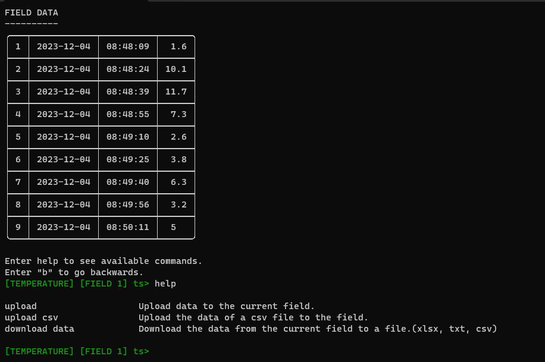

# ThingSpeak - CLI

ThingSpeak-CLI is a command-line interface (CLI) application that allows users to interact with ThingSpeak, an Internet of Things (IoT) platform for collecting and visualizing data from the command line.


## PREVIEW




## Features

- **Channel Management:** View, create, update, and delete ThingSpeak channels.
- **Field Operations:** Add, rename, and delete fields within a channel.
- **Data Interaction:** Upload data to fields, read data, and download data in various formats (csv, txt, xlsx).
- **Hardware Resources Monitoring:** Simulate hardware resource monitoring and upload data to a specific field.

## Installation

Download the repo:

```bash
git clone https://github.com/your-username/ThingSpeak-CLI.git
```

Enter de downloaded directory:

```bash
cd ThingSpeak-CLI
```

Install dependencies:

```bash
pip install -r requirements.txt
```

Run the program and manage your ThingSpeak account form the terminal:

```bash
python main.py
```

Follow the on-screen instructions to perform various actions, such as creating channels, managing fields, and uploading data.

## Contributing

If you'd like to contribute to ThingSpeak-CLI, please follow these steps:

1. Fork the repository.
2. Create a new branch for your feature: `git checkout -b feature-name`
3. Commit your changes: `git commit -m "Add feature"`
4. Push to the branch: `git push origin feature-name`
5. Submit a pull request.